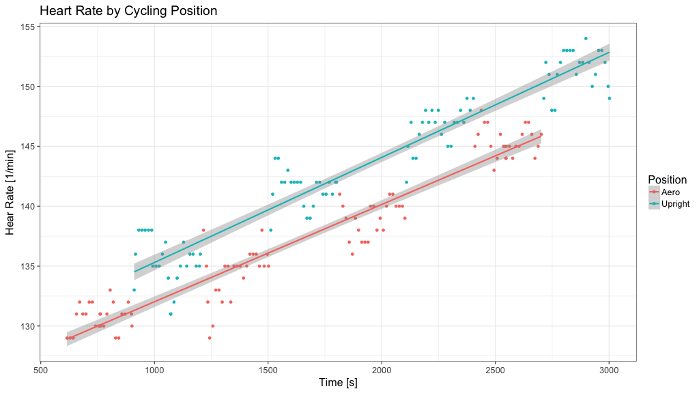

# Heart Rate by Cycling Position

This little project is about the effect of two different cycling positions on heart rate.

Please load the R markdown file and knit it. 

The resulting document will show you the effect on heart rate while changing the cycling position from areo to upright and back again every 5 minutes. I did the experiment on a trainer with constant power and cadence.

